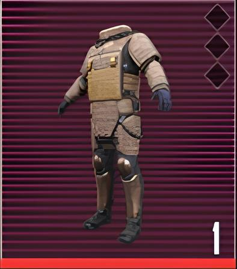
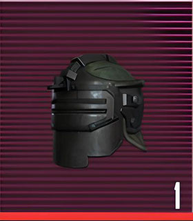
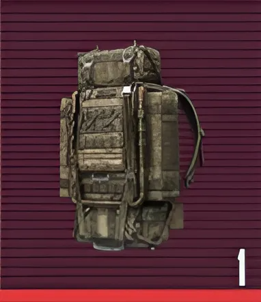
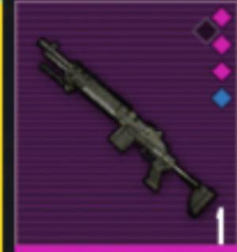

<html lang="ru">
<head>
<meta charset="UTF-8">
<meta name="viewport" content="width=device-width, initial-scale=1.0">
<title>Metro Shop Pol1xer — Violet Ultra 4.2</title>

</head>
<body>

<header>
<h1>МЕТРО ШОП POL1XER</h1>
</header>

<!-- Категории – теперь вместо меню -->

<button onclick="filterCategory('all')">Все</button>
<button onclick="filterCategory('armor')">Броня</button>
<button onclick="filterCategory('loot')">Лут</button>
<button onclick="filterCategory('vip')">VIP</button>

<button id="cartBtn">🛒 Корзина</button>
<button id="chatBtn">💬</button>
<button id="musicBtn">🎵</button>

<!-- Окно поддержки -->

<h3>Поддержка</h3>
<button onclick="tg.openLink('https://t.me/pol1xer')">Написать @pol1xer</button>
<button class="close-cart" onclick="document.getElementById('chatWindow').style.display='none'">Закрыть</button>

<!-- Корзина -->

<h2>Корзина</h2>

<h3>Итого: 0 ₽</h3>
<button class="close-cart" onclick="closeCart()">Закрыть</button>

<!-- ⚡ ТОВАРЫ 3-в-ряд -->

SALE

<h3>Броня Lv.6</h3>

700 ₽

<button class="btn" onclick="addToCart('Броня Lv.6',700)">Купить</button>

<h3>Шлем Lv.6</h3>

450 ₽

<button class="btn" onclick="addToCart('Шлем Lv.6',450)">Купить</button>

SALE

<h3>Фиолетовый Лут</h3>

300 ₽

<button class="btn" onclick="addToCart('Фиолетовый Лут',300)">Купить</button>

VIP

<h3>МК14 ВЫШКА</h3>

900 ₽

<button class="btn" onclick="addToCart('МК14 Вышка',900)">Купить</button>

<!-- Новый товар 1 -->

<h3>Эпический Лут</h3>

550 ₽

<button class="btn" onclick="addToCart('Эпический Лут',550)">Купить</button>

<!-- Новый товар 2 -->

<h3>Броник Тактик</h3>

650 ₽

<button class="btn" onclick="addToCart('Броник Тактик',650)">Купить</button>

<!-- Футер -->
<footer>
  

  

    

      <a href="https://t.me/pol1xer" target="_blank" style="color:var(--neon);margin:0 10px;text-decoration:none;font-weight:700;text-shadow:var(--neon-glow);">@pol1xer</a>
      <a href="https://discord.com" target="_blank" style="color:var(--neon);margin:0 10px;text-decoration:none;font-weight:700;text-shadow:var(--neon-glow);">Discord</a>
      <a href="https://vk.com" target="_blank" style="color:var(--neon);margin:0 10px;text-decoration:none;font-weight:700;text-shadow:var(--neon-glow);">VK</a>
      <a href="mailto:support@metroshop.com" style="color:var(--neon);margin:0 10px;text-decoration:none;font-weight:700;text-shadow:var(--neon-glow);">Email</a>
    

    

      🔥 Скидки на броню Lv.6! VIP лут только сегодня! 🛒 Не пропусти!
    

    

      Онлайн: 27 игроков | Продано сегодня: 13 предметов
    

  

</footer>

<audio id="music" loop>
  <source src="https://files.catbox.moe/3j2d0q.mp3">
</audio>

</body>
</html>

